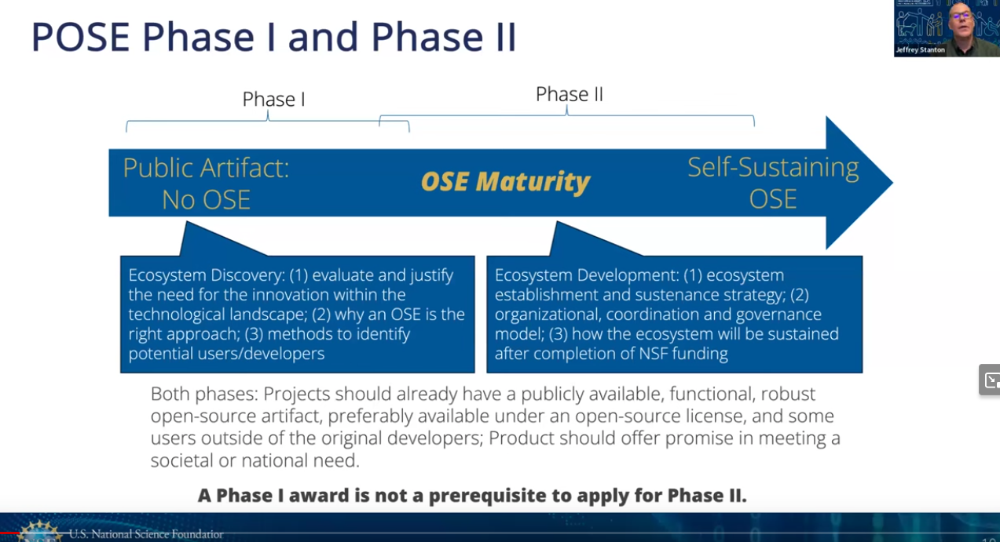

# [./notes/pose-youtube-video](https://www.youtube.com/watch?v=GDugWxxq5xY)

- NSF's 3 priorities
  - Strenghtinng established NSH
  - "Inspiring the millions"
  - 
- 'TIP' directorate
  - first NSF initiative in buncha years
  - 
  
" Use Inspired Research"

Pose - focused on fist 2 (TIP) goals

SBIR - 'about reaching profitability'
POSE - 'about creating self-sustaining ecosytems' 🌱

"Collaboration between developers and end-users"

 (note - this is different from whats in the FOA)

"Purpose of POSE is to scope and create a  managing organization"

👇"minimal set of requirements"

Pose **CAN** support developer activities (esp around creating of onboarding, docs, ecosytem dev, etc)

POSE **NOT** design to fund 'core development activities' (features, etc)

"Community of developers must be 'evergreen' in the sense of built around bringing people in and training new devs"

We are doing Phase 2

- emphasis on 'self-sustaining' and 'building a managing oragnization'
  

Need **Letters of collaboration** 

$1.5M for 2 years - GOAL IS THAT BUY THE END OF THE FUNDING PERIOD, A SELF-SUSTAINING ECOSYTEM EXISTS

## Security Plan 

## Budget Requirements

"More than normal"

NSF generally does not like to support international stuff ('conferences are a possibility')

**OFFICE HOURS EXIST - EMAIL `pose@nsf.gov` if you can't find info)

# DUE Sept 5th 
"NSF aims to provide outcome within 6 months of submission"

# Folks involved

## Q&A 
- https://youtu.be/GDugWxxq5xY?si=n3RmNIDVrVuY1Qmb&t=1277
"A lot of folks  create a non-profit in the course of a Phase 2 award" 

Letters are important 